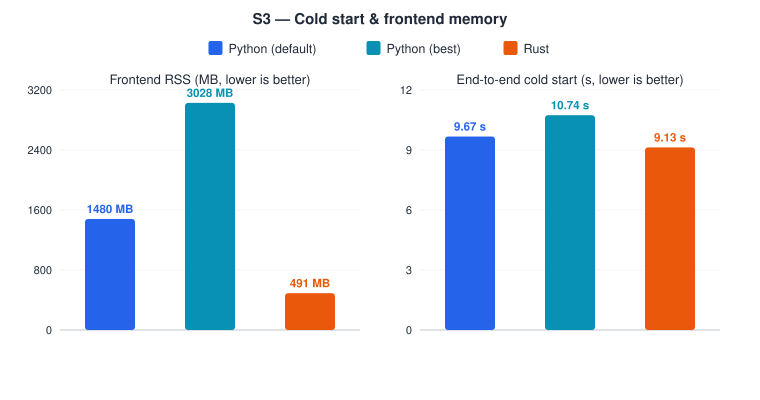
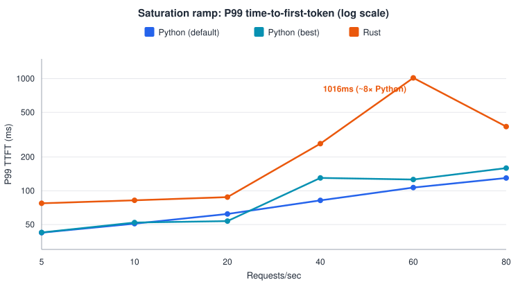

# mini-rsglang

mini-sglang with its Python frontend swapped for an optimized Rust frontend —
built on top of [`sgl-project/mini-sglang`](https://github.com/sgl-project/mini-sglang)
(MIT), pinned at `9a91cfa`.

The Python/CUDA backend (scheduler, engine, KV cache, kernels) is vendored in
unmodified and shared by both frontends. The frontend processes — API server,
tokenizer, detokenizer — are rewritten in Rust: concurrent ingress, a
request-lifecycle FSM, Hugging Face tokenization/detokenization, and the same
ZMQ + MessagePack wire format upstream's own Python frontend speaks to the
scheduler. One repo, one backend, two frontends you can launch with a single
flag and A/B against each other on identical hardware.

```
Rust:    HTTP/SSE ingress → lifecycle FSM → tokenize/detokenize  ─┐
                                                                   ├─► ZMQ/msgpack ─► Python scheduler + GPU kernels (unmodified)
Python:  HTTP ingress → tokenizer/detokenizer managers           ─┘
```

This is a learning-and-proof project: it exists to answer, with real
measurements rather than assumption, *how much does rewriting only the
frontend in Rust actually buy you*, while holding the GPU backend fixed and
identical for both.

## Why

Rewrite-the-frontend-in-Rust is a real, live architectural bet — SGLang's own
team is doing it in production
([sgl-project/sglang#23206](https://github.com/sgl-project/sglang/issues/23206)).
This project reproduces the same bet at a scale one person can build,
benchmark, and fully understand end to end: a byte-compatible Rust
reimplementation of the frontend, a rigorous differential-correctness suite
(same input → same tokens, same streamed output, byte-for-byte), and a
benchmark harness built for exactly three host-overhead-bound scenarios where
a frontend rewrite should matter most — concurrent load with cancellations,
short-prompt RPS saturation, and cold start / host RAM.

**The honest result so far is not "Rust wins."** See below for the numbers,
or [`docs/benchmarks/FINDINGS.md`](docs/benchmarks/FINDINGS.md) for the full
write-up.

## Results

Holding the GPU backend completely unmodified and identical for both
frontends, the outcome is a split: Rust wins decisively on cold start and
memory, loses decisively on tail latency under load, and roughly ties on raw
throughput. Full methodology, statistical significance (Welch's 95% CI), and
root-cause investigation: **[docs/benchmarks/FINDINGS.md](docs/benchmarks/FINDINGS.md)**.

Three frontends were benchmarked against the *same* backend process:

- **Rust** — this project's frontend.
- **python-default** — Python's out-of-the-box setting (`--num-tokenizer=0`:
  one process does both tokenize and detokenize).
- **python-best** — Python tuned by sweeping `--num-tokenizer` for its
  highest peak RPS (`--num-tokenizer=2`: separate tokenizer processes).
  Included so Rust is measured against Python's *best* case, not just its
  defaults.

### Cold start & memory — Rust wins



| | python-default | python-best | **Rust** |
|---|---|---|---|
| End-to-end cold start | 9.67s | 10.74s | **9.13s** |
| Frontend memory (RSS) | 1.48 GB | 3.03 GB | **490 MB** |

### Tail latency under load — Rust loses

Two separate load tests tell the same story. P50 is the typical case;
**P99 is the worst 1% of requests** — the users most likely to notice
something is wrong.

**128 concurrent agents, random requests with mid-stream cancellations:**

| | python-default | python-best | **Rust** |
|---|---|---|---|
| P50 time-to-first-token | 54.0 ms | 54.2 ms | 75.0 ms |
| **P99 time-to-first-token** | 409 ms | 431 ms | **4687 ms (~10×)** |

**Steadily increasing request rate, until the server saturates:**



Once the backend scheduler is saturated rather than under cancellation
churn, raw throughput (GPU-bound workload) is statistically tied — every
confidence interval includes zero, the expected result when the backend,
not the frontend, is the bottleneck.

### Why tail latency regresses: a root cause, not a bug

Every request funnels through one ZMQ socket to the same, unmodified Python
scheduler. Under concurrent load, that transport is usually instant but
occasionally stalls for over a second — a standalone micro-benchmark
(`crates/zmq-vs-channel-spike/`) reproduces this exact pattern, and it's
independently corroborated by SGLang's own production Rust-migration RFC,
which abandoned ZMQ for the same reason. Removing that bottleneck means
patching the Python backend, which is outside this project's "frozen
backend, fair comparison" constraint — see
[FINDINGS.md § Root cause investigation](docs/benchmarks/FINDINGS.md#root-cause-investigation).

### Future work

- **Confirm the queue-depth hypothesis with live data** — correlate the
  `rsg_writer_queue_depth` metric (exposed on `/metrics`) against TTFT
  spikes in a real run.
- **In-process, zero-copy IPC** — remove the ZMQ hop entirely, the
  architecturally complete fix; requires patching the vendored backend, so
  it's a deliberate scope decision, not an oversight.
- **Rust radix-tree KV cache** — follow SGLang's own
  `UnifiedTreeCoreInterface` pattern
  ([sgl-project/sglang#20415](https://github.com/sgl-project/sglang/issues/20415))
  if the backend-frozen constraint is ever revisited.

## Running it

```bash
# Python frontend (upstream's own launcher, unchanged)
python -m rsglang.launch --frontend python --model Qwen/Qwen3-0.6B --port 1919

# Rust frontend (same backend, same wire protocol, same port)
python -m rsglang.launch --frontend rust --model Qwen/Qwen3-0.6B --port 1919
```

Both speak the same OpenAI-compatible HTTP API on the same port. Requires a
CUDA GPU for real inference; a mock backend (`crates/rsg-bench/src/bin/rsg-mock-stack.rs`)
lets the Rust side be developed and tested without one — the whole repo is
developed on a Mac and only verified end-to-end on Linux/CUDA.

## Reproducing the benchmarks

```bash
scripts/gpu_phase7_bench.sh   # Linux + CUDA GPU required
```

Runs preflight checks, a `--num-tokenizer` sweep, then all three scenarios for
both frontends, and writes `docs/benchmarks/frontend-benchmarks.{json,md}`.
See [`docs/benchmarks/FINDINGS.md`](docs/benchmarks/FINDINGS.md) for the
write-up.

## Repository layout

| Path | What |
|---|---|
| `vendor/mini-sglang/` | Upstream, unmodified, pinned at `vendor/UPSTREAM_SHA` |
| `python/rsglang/launch.py` | The single `--frontend python\|rust` entry point |
| `crates/rsg-server/` | The Rust frontend: HTTP/SSE, lifecycle FSM, ZMQ transport |
| `crates/rsg-tokenizer/` | Hugging Face tokenizer/detokenizer, chat templates |
| `crates/rsg-wire/` | msgpack wire types, byte-for-byte matched to upstream |
| `crates/rsg-bench/` | The benchmark harness (this project's other real deliverable) |
| `docs/benchmarks/` | Every measured result, baseline through final findings |
| `.planning/` | [GSD](https://github.com) phase plans, verification reports, decisions |

## License

The vendored upstream (`vendor/mini-sglang/`) keeps its own MIT license and
copyright notice — see `vendor/mini-sglang/LICENSE`. This project's own code
(everything outside `vendor/`) is not yet under a declared license.
